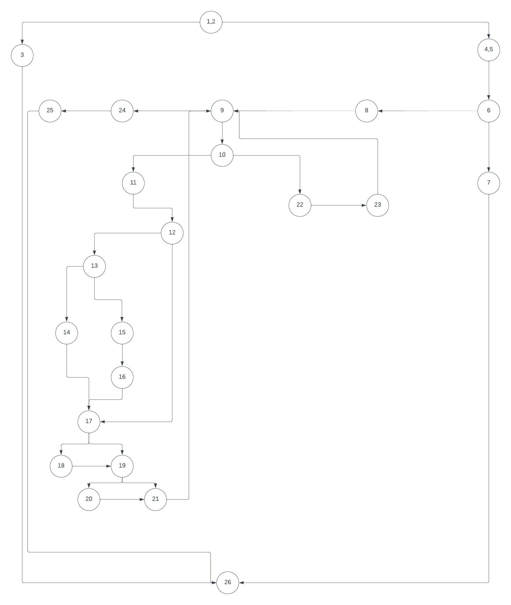
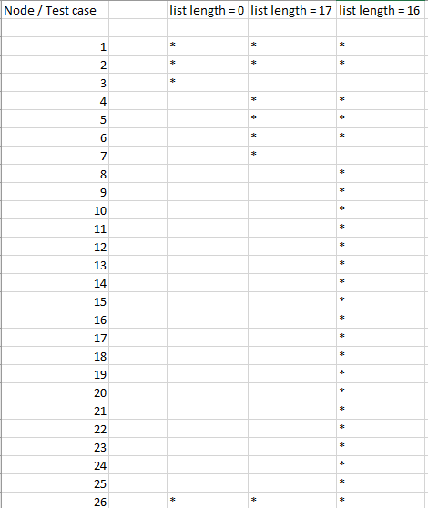
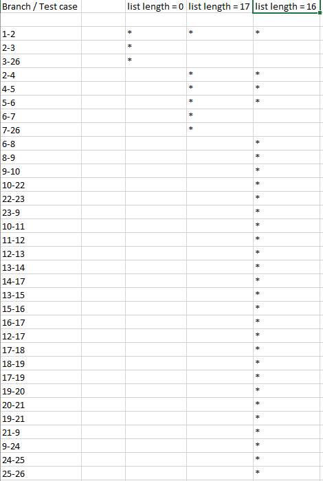

# SI_2022_lab2_203106
Control flow graph:

Тест случаи според критериумот Every statement:

Every State методата служи за да истестираме дали ни поминува кодот
во секој јазол кој го имама. За да го истестирам овај код потребни ми се 
3 тест примери за кодот да може точно да помине.

Тест случаи според критериумот Every path:

Every Branch методата служи за да го истестираме нашиот код во секоја гранка,
за гранка се смета растојанието од јазол А до јазол Б. Правиме онолку тестови
колку што ни се потребни за да нашиот код помине во сите гранки. Во овај код
потребни се 3 тест примери за да можеме да го тестираме целиот код.

Цикломатска комплексност:

Цикломатската комплексност ја преметувам така што го собирам бројот на региони  со +1 - Односно бројот на предикатни јазли е 9 + 1 = 10.
Цикломатската комплексност изнесува 10.

